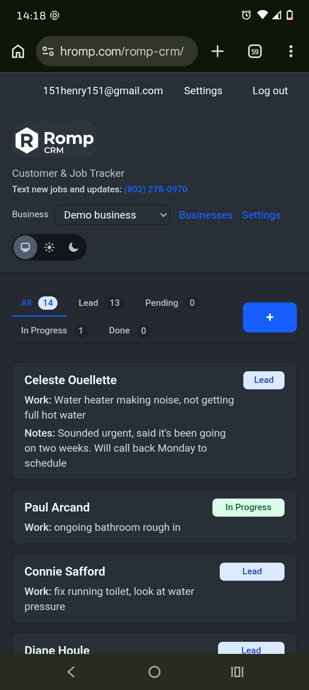
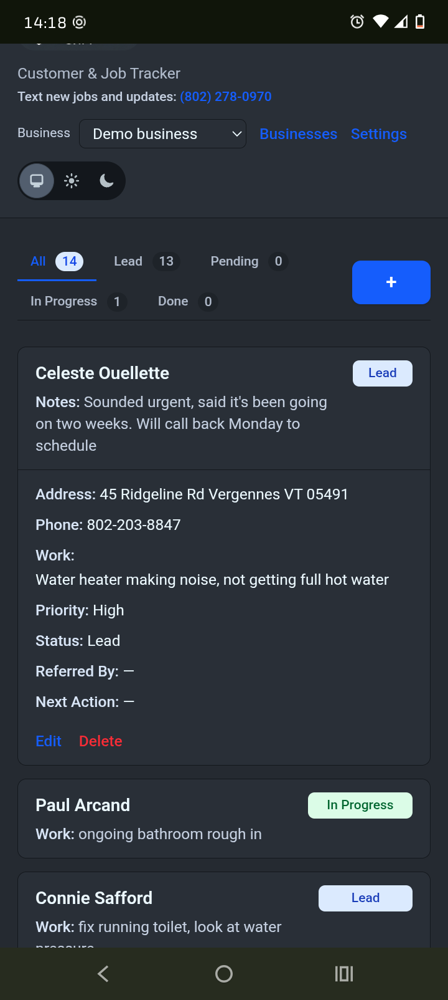
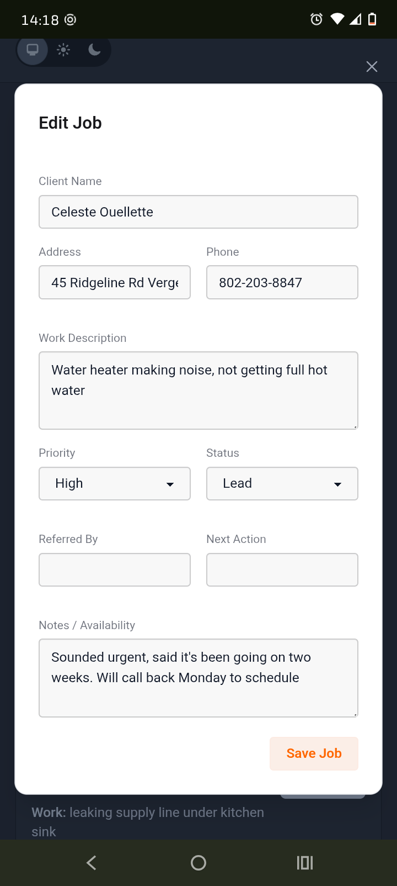
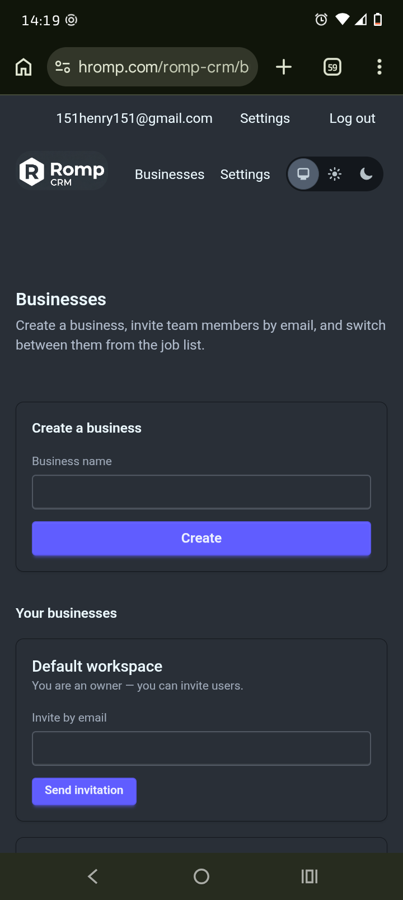

# Romp CRM

Phoenix CRM for **Romp** — jobs list, auth, and inbound SMS leads via Twilio + Anthropic Claude.

The OTP application is **`:romp_crm`** with modules under **`RompCrm.*`** and **`RompCrmWeb.*`**. Public URLs use **Romp CRM** at **`https://hromp.com/romp-crm/`**.

## Screenshots & screen recordings

Captured from the live app. All assets live under **[`docs/screencaps/`](docs/screencaps/)**.

### Screenshots

<table>
  <tr>
    <td align="center" width="50%">
      
    </td>
    <td align="center" width="50%">
      
    </td>
  </tr>
  <tr>
    <td align="center">
      
    </td>
    <td align="center">
      
    </td>
  </tr>
</table>

### Screen recordings (MP4)

| File | Link |
|------|------|
| Recording 1 | **[`1000001486.mp4`](docs/screencaps/1000001486.mp4)** |
| Recording 2 | **[`1000001495.mp4`](docs/screencaps/1000001495.mp4)** |

On GitHub, open the link and use **Download** or **View raw** to play locally (repository-relative video playback in the README itself is not reliable).

## Deploying under a subpath (`https://hromp.com/romp-crm/`)

Phoenix keeps routes at **`/`** on the app server. Your **reverse proxy** must forward `https://hromp.com/romp-crm/...` to **`http://127.0.0.1:<PORT>/...`** by **stripping** the `/romp-crm` prefix. Public URLs use the prefix via **`Endpoint` URL config** (`path_prefix` in `config/prod.exs`).

Example nginx fragment (see `deploy/nginx-location-romp-crm.conf`):

```nginx
location /romp-crm/ {
    proxy_pass http://127.0.0.1:40175/;
    proxy_http_version 1.1;
    proxy_set_header Host $host;
    proxy_set_header X-Forwarded-For $proxy_add_x_forwarded_for;
    proxy_set_header X-Forwarded-Proto $scheme;
    proxy_set_header Upgrade $http_upgrade;
    proxy_set_header Connection "upgrade";
}
```

The trailing slash on **`proxy_pass`** makes nginx map `/romp-crm/foo` → `/foo` on the upstream.

### Checklist

1. Build a **production** release so `config/prod.exs` applies (`path_prefix` is `/romp-crm`).
2. Point nginx at the Phoenix listener port from **`.env.production`** (`PORT`).
3. Restart the app and nginx; open **`https://hromp.com/romp-crm/`**.

### Twilio webhook

**`https://hromp.com/romp-crm/webhooks/twilio/sms`** — HTTP POST — nginx strips the prefix → Phoenix **`/webhooks/twilio/sms`**.

| Env | Purpose |
|-----|---------|
| `TWILIO_AUTH_TOKEN` | Validates `X-Twilio-Signature` |
| `TWILIO_WEBHOOK_PUBLIC_URL` | Optional; set to the **exact** public webhook URL Twilio signs |
| `ANTHROPIC_API_KEY` | SMS → job parsing |

See **`deploy/README.md`** for systemd and env setup.
