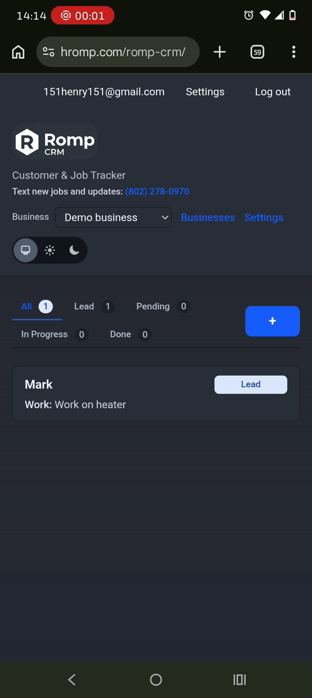

# Romp CRM

Phoenix LiveView CRM for **Romp** — jobs and leads, inbound SMS via Twilio, AI-assisted parsing with Anthropic Claude, reminders, optional PayPal subscription paywall on the hosted product, and more.

The OTP application is **`:romp_crm`** with modules under **`RompCrm.*`** and **`RompCrmWeb.*`**.

## Public URLs

The app is mounted under **`/romp-crm`** behind nginx (Phoenix routes stay at **`/`** on the upstream port; the proxy **strips** the prefix — see below).

| Host | Example |
|------|---------|
| **hromp.com** | `https://hromp.com/romp-crm/` |
| **rompcrm.com** | `https://rompcrm.com/romp-crm/` |

## Self-hosting

- **Marketing / step-by-step HTML:** **[docs/self-hosting-rompcrm.com.html](docs/self-hosting-rompcrm.com.html)** (live copy: **https://rompcrm.com/self-hosting.html**). After editing that file in this repo, install it on the web server, for example:  
  `sudo install -m 644 docs/self-hosting-rompcrm.com.html /path/to/rompcrm.com/public_html/self-hosting.html`
- **Env template:** **[deploy/romp-crm.env.example](deploy/romp-crm.env.example)**
- **Ops checklist (nginx, systemd, Twilio, PayPal):** **[deploy/README.md](deploy/README.md)**

**Typical self-host:** leave **`SUBSCRIPTION_PAYWALL_ENABLED`** unset or **`false`** so accounts are active without PayPal. Set **`true`** only if you supply all PayPal variables enforced in **`config/runtime.exs`**.

## Deploying under a subpath (`/romp-crm`)

Phoenix keeps routes at **`/`** on the app server. Your **reverse proxy** must forward `https://<your-host>/romp-crm/...` to **`http://127.0.0.1:<PORT>/...`** by **stripping** the `/romp-crm` prefix. Public URLs use the prefix via **`Endpoint` URL config** (`path_prefix` in **`config/prod.exs`**).

Example nginx fragment (see **`deploy/nginx-location-romp-crm.conf`**):

```nginx
location /romp-crm/ {
    proxy_pass http://127.0.0.1:40175/;
    proxy_http_version 1.1;
    proxy_set_header Host $host;
    proxy_set_header X-Forwarded-For $proxy_add_x_forwarded_for;
    proxy_set_header X-Forwarded-Proto $scheme;
    proxy_set_header Upgrade $http_upgrade;
    proxy_set_header Connection "upgrade";
}
```

The trailing slash on **`proxy_pass`** makes nginx map `/romp-crm/foo` → `/foo` on the upstream.

### Checklist

1. Build a **production** release so **`config/prod.exs`** applies (`path_prefix` is **`/romp-crm`** unless you change it and rebuild).
2. Point nginx at the Phoenix listener port from **`.env.production`** (`PORT`).
3. Restart the app and nginx; open **`https://<your-host>/romp-crm/`**.

### Twilio webhook

Use your real hostname, for example **`https://rompcrm.com/romp-crm/webhooks/twilio/sms`** or **`https://hromp.com/romp-crm/webhooks/twilio/sms`** — HTTP POST — nginx strips the prefix → Phoenix **`/webhooks/twilio/sms`**.

| Env | Purpose |
|-----|---------|
| `TWILIO_ACCOUNT_SID` | REST API (outbound replies + `mix twilio.configure_sms`) |
| `TWILIO_AUTH_TOKEN` | Validates `X-Twilio-Signature`; Basic auth for Messages API |
| `TWILIO_MESSAGING_FROM` | E.164 sender for replies |
| `TWILIO_SMS_REPLIES_ENABLED` | Set `false` to disable outbound SMS |
| `TWILIO_WEBHOOK_PUBLIC_URL` | Optional; set to the **exact** public webhook URL Twilio signs |
| `TWILIO_MESSAGING_SERVICE_SID` | Optional; used by **`mix twilio.messaging_service_inbound`** when the SMS number sits on a Messaging Service |
| `TWILIO_VOICE_WEBHOOK_PUBLIC_URL` / `TWILIO_VOICE_FORWARD_TO` | Optional; voice webhook (**`/webhooks/twilio/voice`**) |
| `ANTHROPIC_API_KEY` | SMS → job parsing |
| `ANTHROPIC_MODEL` | Defaults in **`config/runtime.exs`** if unset |

See **`deploy/README.md`** for systemd, PayPal provisioning, and Twilio voice.

**Sign-ups:** By default **any** email can register (`ENFORCE_REGISTRATION_ALLOWLIST` is off). Set **`ENFORCE_REGISTRATION_ALLOWLIST=true`** and **`ALLOWED_REGISTRATION_EMAILS`** in production only if you need a private allowlist.

**PayPal paywall:** When **`SUBSCRIPTION_PAYWALL_ENABLED=true`**, **`config/runtime.exs`** requires PayPal client id/secret, plan ids, webhook id (unless skip-verify), etc. — see **`deploy/README.md`**.

## Features (high level)

SMS-driven job updates, workspaces, job list with expandable rows (hours, materials, reminders), **Reminders** (`/reminders`), optional **data export** scheduling, **gifts** and **invitations**, **Support** (`/support`), **Admin** (`/admin`) for configured admin emails, multipart HTML + plain transactional email, and more. See **[CHANGELOG.md](CHANGELOG.md)** for versioned detail.

## Screenshots & screen recordings

Captured from the live app. All assets live under **[`docs/screencaps/`](docs/screencaps/)**.

### Screenshots

<table>
  <tr>
    <td align="center" width="50%">
      
    </td>
    <td align="center" width="50%">
      
    </td>
  </tr>
  <tr>
    <td align="center">
      
    </td>
    <td align="center">
      
    </td>
  </tr>
</table>

### Screen recording

Full capture at **2× speed** (~32s playback for ~65s of screen time). **[Original real-time MP4](docs/screencaps/1000001495.mp4)** is linked if you prefer normal speed.

<p align="center">
  
</p>

<p align="center">
  <video src="docs/screencaps/1000001495-fast.mp4" controls playsinline width="480"></video>
</p>

## License

Romp CRM is free software: you can redistribute it and/or modify it under the terms of the **GNU General Public License** as published by the Free Software Foundation, either **version 3** of the License, or (at your option) any later version. See the file **[`LICENSE`](LICENSE)** in this repository for the full license text.

SPDX: **`GPL-3.0-or-later`**
